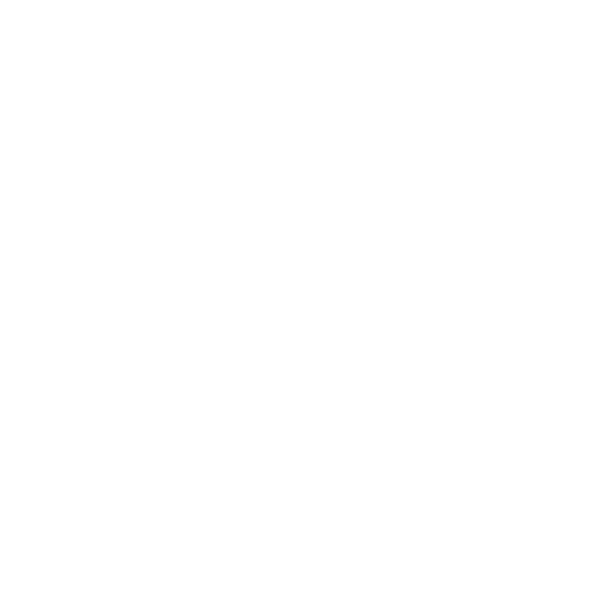

<div align="center">
  
  <h1>field-to-architect</h1>
  <h3>Del campo al arquitecto / From the Field to the Architect</h3>
  <b>12+ anos en el campo. Cada peldano ensenado por el oficio, no por un titulo.</b>

  <br/><br/>

  
  
  
</div>

---

> Cada peldano del arco profesional de Francisco fue ganado en el campo,
> no concedido por un aula. / Every rung of Francisco's professional arc
> was earned in the field, not granted by a classroom.

Este repositorio documenta la trayectoria profesional de Francisco Montanez
desde ayudante electrico hasta arquitecto y CEO de YOSO-YAi LLC. Abarca
industrias petroquimicas, GNL, manufactura automotriz y construccion de
centros de datos a hiperescala. /
This repository documents the professional trajectory of Francisco Montanez
from electrical helper to architect and CEO of YOSO-YAi LLC. It spans
petrochemical, LNG, automotive manufacturing, and hyperscale data center
construction industries.

---

## Tabla de Contenido / Table of Contents

1. [Por que / Why](#1-por-que--why)
2. [El arco / The Arc](#2-el-arco--the-arc)
3. [Ayudante / Helper](#3-ayudante--helper)
4. [Jornalero / Journeyman](#4-jornalero--journeyman)
5. [Tecnico I&C / I&C Technician](#5-tecnico-ic--ic-technician)
6. [Capataz / Foreman](#6-capataz--foreman)
7. [Arquitecto / Architect](#7-arquitecto--architect)
8. [CEO](#8-ceo)
9. [Lo que cada peldano ensena / What Each Rung Teaches](#9-lo-que-cada-peldano-ensena--what-each-rung-teaches)
10. [Licencia / License](#10-licencia--license)

---

## 1. Por que / Why

**ES:** Porque la industria de la construccion separa "diseno" de "campo" como
si fueran dos mundos. No lo son. Cada decision de diseno tiene una
consecuencia en el campo, y cada leccion del campo deberia informar el
diseno. Francisco cruzo ambos mundos. Este repositorio es el registro de
ese cruce. Lo que un ingeniero de controles industriales disena cuando
aplica su disciplina a infraestructura de IA por primera vez.

La separacion entre "los que disenan" y "los que construyen" es artificial.
El ingeniero que nunca ha doblado conduit disena curvas imposibles. El
jornalero que nunca ha visto un esquematico no entiende por que la ruta
importa. Francisco vivio ambos lados. Este documento conecta los dos.

**EN:** Because the construction industry separates "design" from "field" as
if they were two worlds. They are not. Every design decision has a field
consequence, and every field lesson should inform design. Francisco crossed
both worlds. This repository is the record of that crossing. What an
industrial controls engineer designs when they apply their discipline to AI
infrastructure for the first time.

The separation between "those who design" and "those who build" is
artificial. The engineer who has never bent conduit designs impossible bends.
The journeyman who has never seen a schematic does not understand why the
route matters. Francisco lived both sides. This document connects the two.

---

## 2. El arco / The Arc

```
  2014          2017     2019    2020      2021     2022       2024    2025
   |             |        |       |         |        |          |       |
   +-- Fluor ----+        |       +- Tesla -+        +-- Meta --+       |
   |  Ayudante /  \       |       | I&C     |        | Capataz  |       |
   |  Jornalero    \      |       | Tecnico |        | Foreman  |       |
   |  Helper /      \     |       |         |        |          |       |
   |  Journeyman     +----+       |         |        |          |       |
   |               Independiente  |         |        |          +-------+
   |               Independent    |         |        |          YOSO-YAi
   |                              |         |        |          Arquitecto
   |                              |         |        |          & CEO
   v                              v         v        v          v
  CAMPO / FIELD                                            ARQUITECTURA
  Petroquimica, GNL              Automotriz          Hiperescala
  Petrochemical, LNG             Automotive          Hyperscale
```

Empresas confirmadas / Confirmed companies:
Fluor Corporation, McDermott, SST, MMR, Tesla, Meta

Industrias / Industries:
Petrochemical, LNG, automotive manufacturing, hyperscale data center
construction.

---

## 3. Ayudante / Helper

**ES:** Fluor Corporation (2014-2017). Electricidad industrial, doblado de
conduit, trabajo de campo en instalaciones petroquimicas y de GNL. El
ayudante carga material, aprende a leer planos, y observa como los
jornaleros ejecutan el oficio. Aqui se aprende que la calidad se mide en
las terminaciones, no en las presentaciones. El ayudante observa todo: quien
trabaja con disciplina y quien corta esquinas, que capataz cuida a su gente
y cual los trata como herramientas desechables.

**EN:** Fluor Corporation (2014-2017). Industrial electrical, conduit bending,
field work in petrochemical and LNG facilities. The helper carries
material, learns to read drawings, and watches how journeymen execute the
craft. Here you learn that quality is measured at the terminations, not in
the presentations. The helper observes everything: who works with discipline
and who cuts corners, which foreman takes care of the crew and which one
treats them as disposable tools.

---

## 4. Jornalero / Journeyman

**ES:** Fluor Corporation y contratistas independientes (2014-2019). Jornalero
electrico. Conduit bending, cableado industrial, terminaciones de potencia.
El jornalero es responsable de su propio trabajo y del trabajo de sus
ayudantes. La disciplina del oficio se internaliza aqui. En ambientes
petroquimicos y de GNL, la precision no es opcional. Cada conexion, cada
sello, cada puesta a tierra tiene un procedimiento. Seguirlo es la
diferencia entre seguridad y desastre.

**EN:** Fluor Corporation and independent contractors (2014-2019). Electrical
journeyman. Conduit bending, industrial wiring, power terminations. The
journeyman is responsible for their own work and the work of their helpers.
The discipline of the craft is internalized here. In petrochemical and LNG
environments, precision is not optional. Every connection, every seal, every
ground has a procedure. Following it is the difference between safety and
disaster.

---

## 5. Tecnico I&C / I&C Technician

**ES:** Tesla Gigafactory (2020-2021). Instrumentacion y controles:
integracion de sensores, logica PLC, calibracion de instrumentos. El
tecnico I&C vive en la frontera entre el mundo electrico y el mundo de
datos. Aqui Francisco aprendio que la senal es tan importante como la
potencia. Cada sensor alimenta un PLC. Cada PLC ejecuta logica. Cada
salida del PLC controla un actuador. El trabajo del tecnico I&C es
asegurar que la cadena completa funcione: desde el fenomeno fisico hasta
la accion del sistema.

**EN:** Tesla Gigafactory (2020-2021). Instrumentation and controls: sensor
integration, PLC logic, instrument calibration. The I&C technician lives
at the boundary between the electrical world and the data world. Here
Francisco learned that the signal is as important as the power. Each sensor
feeds a PLC. Each PLC executes logic. Each PLC output controls an actuator.
The I&C technician ensures the entire chain works: from the physical
phenomenon to the system action.

---

## 6. Capataz / Foreman

**ES:** Meta NightCrawler (2022-2024). Capataz electrico: distribucion de
potencia, cableado de centros de datos, coordinacion de cuadrillas. El
capataz sostiene la linea entre la intencion de ingenieria y la realidad
del campo. Francisco observo de primera mano: instalaciones apresuradas,
artesania comprometida, sistemas fragiles enviados porque el calendario
era lo unico que importaba. El capataz asigna trabajo, rastrea progreso,
resuelve conflictos, y reporta estado diariamente. La presion del
cronograma empuja constantemente contra la calidad. Resistir esa presion
es el trabajo real del capataz.

**EN:** Meta NightCrawler (2022-2024). Electrical foreman: power distribution,
data center wiring, crew coordination. The foreman holds the line between
engineering intent and field reality. Francisco watched firsthand: rushed
installations, compromised craftsmanship, fragile systems shipped because
the schedule was the only thing that matters. The foreman assigns work,
tracks progress, resolves conflicts, and reports status daily. Schedule
pressure constantly pushes against quality. Resisting that pressure is the
real job of the foreman.

---

## 7. Arquitecto / Architect

**ES:** YOSO-YAi LLC (2025-presente). Arquitecto de infraestructura de IA.
KiCad para electrica, Fusion 360 para mecanica 3D, NVIDIA Omniverse para
diseno espacial. La postura de ingenieria del RIB refleja la trayectoria
de Francisco: electricidad industrial, instrumentacion, controles,
distribucion de potencia de su carrera en Tesla y anteriores. La transicion
del campo al diseno no es un salto. Es una extension natural: despues de
instalar cientos de sistemas, empiezas a ver los patrones. Despues de ver
los patrones, empiezas a mejorarlos. Despues de mejorarlos, los disenas
desde cero.

**EN:** YOSO-YAi LLC (2025-present). AI infrastructure architect. KiCad for
electrical, Fusion 360 for mechanical 3D, NVIDIA Omniverse for spatial
design. The RIB engineering posture reflects Francisco's trajectory:
industrial electrical, instrumentation, controls, power distribution from
his Tesla and prior career. The transition from field to design is not a
leap. It is a natural extension: after installing hundreds of systems, you
start to see the patterns. After seeing the patterns, you start improving
them. After improving them, you design from scratch.

---

## 8. CEO

**ES:** YOSO-YAi LLC (2025-presente). De ayudante a CEO. La empresa construye
infraestructura de IA con la disciplina del campo, no a pesar de ella.
12+ anos de experiencia en el campo son la base de cada decision de diseno.
Cuando el CEO ha doblado conduit, jalado cable, terminado switchgear,
calibrado sensores, y coordinado cuadrillas, las decisiones de diseno
cambian. No se disenan cosas que son imposibles de instalar.

**EN:** YOSO-YAi LLC (2025-present). From helper to CEO. The company builds AI
infrastructure with the discipline of the field, not in spite of it.
12+ years of field experience form the foundation of every design decision.
When the CEO has bent conduit, pulled wire, terminated switchgear, calibrated
sensors, and coordinated crews, the design decisions change. You do not
design things that are impossible to install.

---

## 9. Lo que cada peldano ensena / What Each Rung Teaches

| Peldano / Rung           | Periodo / Period | Industria / Industry         | Empresa / Company    | Disciplina / Discipline                          |
|--------------------------|------------------|------------------------------|----------------------|--------------------------------------------------|
| Ayudante / Helper        | 2014-2017        | Petroquimica, GNL            | Fluor Corporation    | Electricidad industrial, doblado de conduit       |
| Jornalero / Journeyman   | 2014-2019        | Petroquimica, GNL            | Fluor, independiente | Oficio electrico, terminaciones de potencia       |
| Tecnico I&C              | 2020-2021        | Manufactura automotriz       | Tesla Gigafactory    | Sensores, logica PLC, integracion I&C             |
| Capataz / Foreman        | 2022-2024        | Centros de datos hiperescala | Meta NightCrawler    | Distribucion de potencia, cableado, cuadrillas    |
| Arquitecto / Architect   | 2025-presente    | Infraestructura de IA        | YOSO-YAi LLC         | KiCad, Fusion 360, Omniverse                     |
| CEO                      | 2025-presente    | Infraestructura de IA        | YOSO-YAi LLC         | Vision, estrategia, ejecucion                     |

**ES:** Cada peldano construye sobre el anterior. No hay atajos. La
experiencia de campo es el cimiento de todo lo que sigue.

**EN:** Each rung builds on the one before it. There are no shortcuts. Field
experience is the foundation of everything that follows.

---

## 10. Licencia / License

Este trabajo esta licenciado bajo
[Creative Commons Attribution-ShareAlike 4.0 International (CC-BY-SA-4.0)](https://creativecommons.org/licenses/by-sa/4.0/).

Usted es libre de compartir y adaptar este material para cualquier proposito,
incluyendo comercial, bajo los siguientes terminos:

- **Atribucion** -- credito a YOSO-YAi LLC y Francisco Montanez.
- **CompartirIgual** -- distribuya obras derivadas bajo la misma licencia.

This work is licensed under
[Creative Commons Attribution-ShareAlike 4.0 International (CC-BY-SA-4.0)](https://creativecommons.org/licenses/by-sa/4.0/).

You are free to share and adapt this material for any purpose, including
commercial, under the following terms:

- **Attribution** -- credit YOSO-YAi LLC and Francisco Montanez.
- **ShareAlike** -- distribute derivative works under the same license.
